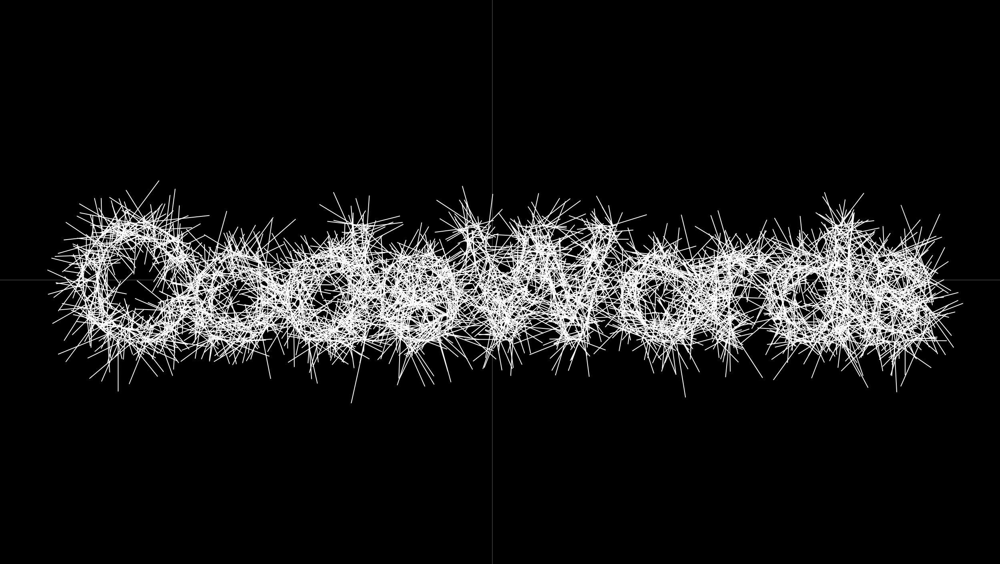
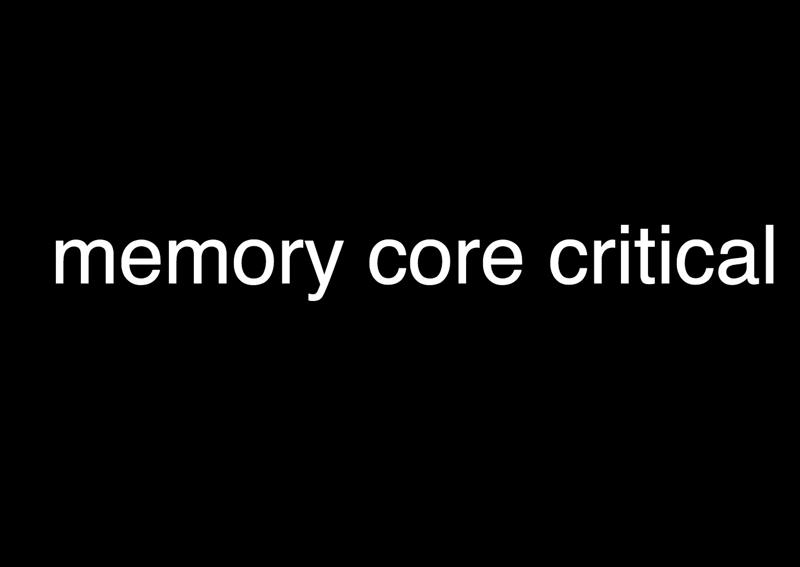

# Text to points & other fun functions
 
### [Codewords Splash page demo](https://karenanndonnachie.github.io/AtotheK/Chapter_4/codewords_demo/) 
#### The code that counts: 
`points = font.textToPoints(
  word, 0, 0, size, {
  sampleFactor: 0.75,
  simplifyThreshold: 0    
    });`
 
## Working examples in p5js click on image for 'in action' 
In&nbsp;action&nbsp;&nbsp;&nbsp;&nbsp;&nbsp;&nbsp; | Description | [P5 js Library](https://p5js.org/libraries/) | Possible use / demo | Example Sketch/folder 
----------------- | ------------- | ------------- | ------------- | ------------- 
 | Sound In / Out / Volume etc | [P5.sound.js](https://p5js.org/reference/#/libraries/p5.sound) | Play music / analyse sound **NEEDS SOUND LIBRARY** | <a href="P5js_soundTest/" target="_blank">soundTest/</a>
 | Paragraph text | [P5 js](https://p5js.org/reference/) | Import text / animate as wave | <a href="../chapter 2/TextParaMobyDick/" target="_blank">TextParaMobyDick/</a>
<a href= "https://karenanndonnachie.github.io/Slave-To-The-Algorithm/P5js/CODEWORDS13aug/"> | Import Fonts & Animate text | [P5 js](https://p5js.org/reference/)  | Translate/Rotate animate / map() function | <a href="spinnyText/" target="_blank">spinnyText/</a>
 | Lots of wiggly letters all over... | [P5 js](https://p5js.org/reference/) + [custom Class](https://p5js.org/reference/#/p5/class) | Fill Window with text, erase with mouse | <a href="randomLettersErase/" target="_blank">randomLettersErase/</a>
 | Lots of wiggly letters on mouseclick WITH CLASS CONSTRUCTOR & KEYTYPED | [P5 js](https://p5js.org/reference/) + [custom Class](https://p5js.org/reference/#/p5/class) | Fill Window on mousePress() | <a href="wigglyRandomLetters/" target="_blank">wigglyRandomLetters/</a>
 | Draw with Vectors & count points | [P5 js](https://p5js.org/reference/) + [custom Class](https://p5js.org/reference/#/p5/class) | Drawing app that tracks "complexity" | <a href="doodleVector_p5js/" target="_blank">doodleVector_p5js/</a>
 | Speech to Text from microphone | [P5 Speech library](https://idmnyu.github.io/p5.js-speech/) | Uses microphone as input, writes text to screen. Can also do the inverse (ie. read a text) **NEEDS P5 SPEECH LIBRARY** | <a href="p5Speech_singleLineContinuous/" target="_blank">code here</a>
<a href="https://github.com/FreddieRa/p5.3D/wiki/Word3D" target="_blank"> | 3D TEXT with WEBGL P5js | [Github Repo](https://github.com/FreddieRa/p5.3D/wiki/Word3D) | Can make words, shapes and more in 3D with WEBGL | no demo 
<a href="https://karenanndonnachie.github.io/AtotheK/Chapter_4/codewords_demo/"> | p5js textToPoints() function | [textToPoints()](https://p5js.org/reference/#/p5.Font/textToPoints) | Uses loaded font geometry to create points | [code here](https://github.com/karenanndonnachie/AtotheK/tree/main/Chapter_4/codewords_demo/)
<a href="https://karenanndonnachie.github.io/AtotheK/chapter 2/TextSimpleKerning/"> | textWidth() & slider | [P5js Slider](https://p5js.org/reference/#/p5/createSlider) | Uses a slider to visualise letter spacing | [code here](https://https://github.com/karenanndonnachie/AtotheK/tree/main/chapter 2/TextSimpleKerning/)
<a href="https://karenanndonnachie.github.io/AtotheK/Chapter_4/TextToPoints_Para_appearOverTime"> | textToPoints() & sentence.split(' ') | [p5js texttopoints()](https://p5js.org/reference/#/p5.Font/textToPoints) | Can break down and 'set' type within canvas contraints as paragraph, words, letters or points | <a href="TextToPoints_Para_appearOverTime/">TextToPoints_Para_appearOverTime
 ## Example of Keyboard functions
<pre>function keyPressed()
{
  // UP key
  if(keyCode == UP_ARROW)
  {
    ypos = ypos - numPixels; 
  }
 
  // DOWN key
  if(keyCode == DOWN_ARROW)
  { 
    ypos = ypos + numPixels; 
  }
 
  // RIGHT key
  if(keyCode == RIGHT_ARROW)
  {
    xpos = xpos + numPixels; 
  }
 
  // LEFT key
  if(keyCode == LEFT_ARROW)
  {
    xpos = xpos - numPixels; 
  }
}
</pre>
## Mouse Events
Working with mouse events using p5js is easy. We can create sketches that do various things based on the mouse's position on the screen or when the mouse button is pressed, 
etc. Here is a list of the mouse related functions in p5js:
<ul> 
	<li><a href="http://p5js.org/reference/#/p5/mouseX">mouseX</a></li>
	<li><a href="http://p5js.org/reference/#/p5/mouseY">mouseY</a></li>
	<li><a href="http://p5js.org/reference/#/p5/pmouseX">pmouseX</a></li>
	<li><a href="http://p5js.org/reference/#/p5/pmouseY">pmouseY</a></li>
	<li><a href="http://p5js.org/reference/#/p5/winMouseX">winMouseX</a></li>
	<li><a href="http://p5js.org/reference/#/p5/winMouseY">winMouseY</a></li>
	<li><a href="http://p5js.org/reference/#/p5/pwinMouseX">pwinMouseX</a></li>
	<li><a href="http://p5js.org/reference/#/p5/pwinMouseY">pwinMouseY</a></li>
	<li><a href="http://p5js.org/reference/#/p5/mouseButton">mouseButton</a></li>
	<li><a href="http://p5js.org/reference/#/p5/mouseIsPressed">mouseIsPressed</a></li>
	<li><a href="http://p5js.org/reference/#/p5/mouseMoved">mouseMoved()</a></li>
	<li><a href="http://p5js.org/reference/#/p5/mouseDragged">mouseDragged()</a></li>
	<li><a href="http://p5js.org/reference/#/p5/mousePressed">mousePressed()</a></li>
	<li><a href="http://p5js.org/reference/#/p5/mouseReleased">mouseReleased()</a></li>
	<li><a href="http://p5js.org/reference/#/p5/mouseClicked">mouseClicked()</a></li>
	<li><a href="http://p5js.org/reference/#/p5/mouseWheel">mouseWheel()</a></li>
</ul>
## Touch events
<ul>
	<li><a href="http://p5js.org/reference/#/p5/touchX">touchX</a></li>
	<li><a href="http://p5js.org/reference/#/p5/touchY">touchY</a></li>
    <li><a href="http://p5js.org/reference/#/p5/touches[]">touches[]</a></li>
    <li><a href="http://p5js.org/reference/#/p5/touchStarted">touchStarted()</a></li>
    <li><a href="http://p5js.org/reference/#/p5/touchMoved">touchMoved()</a></li>
    <li><a href="http://p5js.org/reference/#/p5/touchEnded">touchEnded()</a></li>
</ul>
 Find some nice uses of texttopoints here and here also here.
