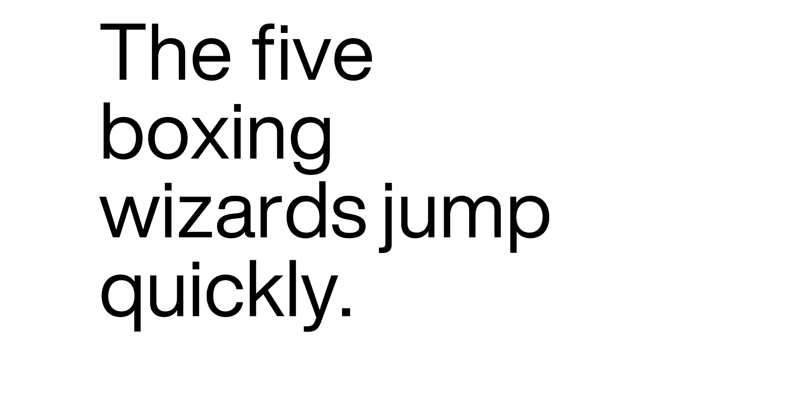
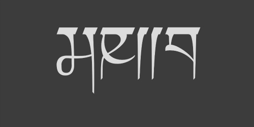

# Type-Sampler & Type-viewer Template Tests
### Simple one letter at a time, white on black, from keyTyped() &/or mousePressed() : [Sample here](https://karenanndonnachie.github.io/AtotheK/Chapter_5/GENFONT_Letters/index.html)  <a href="https://karenanndonnachie.github.io/AtotheK/Chapter_5/GENFONT_Letters/index.html" target="_blank">  </a>
  
### Simple white on black WITH SOUND, from keyTyped() &/or mousePressed() : [Sample here](https://karenanndonnachie.github.io/AtotheK/Chapter_5/GENFONT_Letters_sound/index.html)  <a href="https://karenanndonnachie.github.io/AtotheK/Chapter_5/GENFONT_Letters_sound/index.html" target="_blank">  </a>
  
### Para display with pangram: [Sample here](https://karenanndonnachie.github.io/AtotheK/Chapter_5/typeSamplerTemplate/index.html)  <a href="https://karenanndonnachie.github.io/AtotheK/Chapter_5/typeSamplerTemplate/index.html" target="_blank">  </a>
* toggle between alphanumeric & Pangram on RIGHT arrow key
* toggle ON/OFF points with UP arrow key
* toggle ON/OFF outline (stroke) with LEFT arrow key
* toggle ON/OFF fill() with DOWN arrow key

### Dynamic variable type: [Sample here](https://karenanndonnachie.github.io/AtotheK/Chapter_5/A2K_variable/index.html)  <a href="https://karenanndonnachie.github.io/AtotheK/Chapter_5/A2K_variable/index.html" target="_blank">  </a>
* Set the custom font src url to your font in CSS
* Set the range of your variable font in CSS
* Set the range of your font in the variables in P5js header
* Set the variable to map and the upper/lower limits in the update call eg. updateVariableFont(frameCount, 0, 2000);
