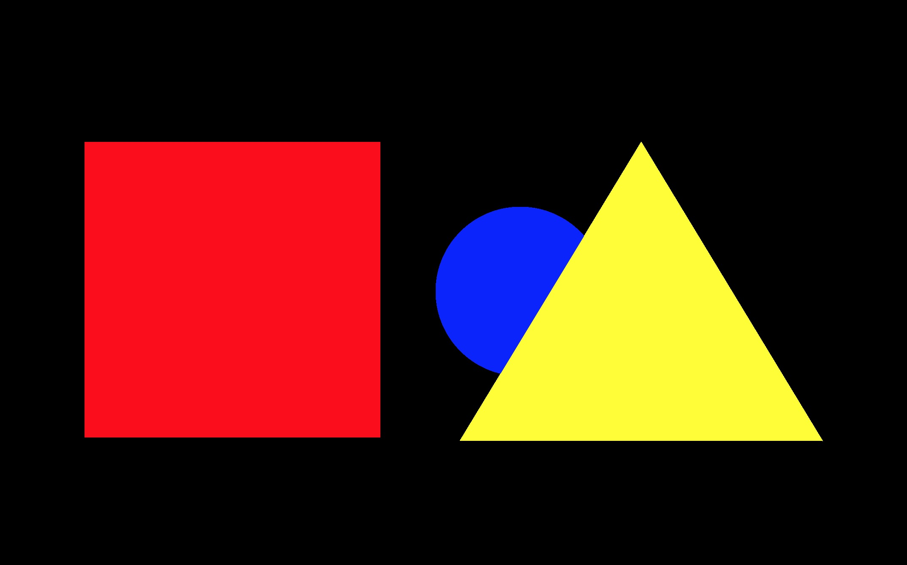
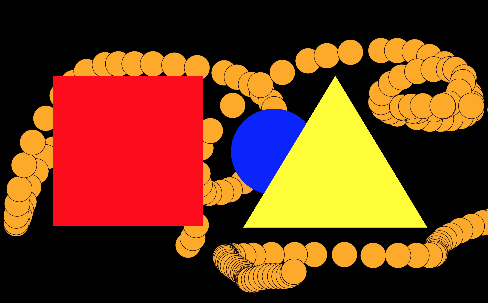

# A to the K \~~> Chapter 1: in the beginning
[chapter 2](https://github.com/karenanndonnachie/AtotheK/tree/main/chapter%202) | [chapter 3](https://github.com/karenanndonnachie/AtotheK/tree/main/Chapter_3) | [chapter 4](https://github.com/karenanndonnachie/AtotheK/tree/main/Chapter_4) | [chapter 5]
# P5js (the web version of Processing)
This folder will contain snippets from Processing workshops and tutorials. 
Some simple starter instructions below.

## Processing START HERE:
Download Processing ( https://processing.org/download/ ) and initiate the P5js mode (from the arrow on the top right of the Processing window --> 'add mode'->p5.js. 
P5js reference and everything else if here: http://p5js.org  
Lots of community knowledge at http://openprocessing.org 
### NEED TO KNOW:
* An empty Processing sketch is made up of the `setup()` and `draw()` functions. You may only ever have ONE `function setup(){}` and ONE `function draw() {}` in any single sketch.
* `setup()` runs once and can set all values that remain static, You must at least create a canvas in this section.
* The `draw()` function loops once every frame. 
* Other functions can be added to be called on demand for example `keyPressed()`, `mousePressed()` and your own custom functions. Nested loops can also occur inside these functions eg. `if(test){ action if true; }` `for (i=0; i<10; i++){ run 10 times; }` 
* You set the fill() and stroke() colours before you draw the item (like dipping a brush in ink)
* Colour can be (r, g, b) ie. red, green, blue values, each set from 0-255. eg 'white' => (255, 255, 255) ; black => (0, 0, 0); or, you can just set a shade of grey. eg 'mid-grey' => (120);
* Fill and Stroke can be turned on and off => `noFill();` and `noStroke();` will turn those properties off until you set them again with a colour. ie `fill(0);` or `stroke(0);`

Common functions found in setup() include:
<pre>createCanvas (w, h); // makes a canvas
background (r, g, b); // colours the canvas with whatever colour you put in as r, g, b
</pre>
[Watch "1 Minute of Code #01: p5js SETUP CANVAS" on Vimeo pw=A2THEK](https://vimeo.com/536189627)
### Primitive Shapes [EXAMPLE SKETCH]: 
#### An example of a simple sketch from start to end (copy and paste it into your editor -entirely overwriting the existing text- and press play -> top left of editor):

<pre>function setup() {
  createCanvas (windowWidth, windowHeight);
  background (0, 0, 0);
}

function draw() {
  noStroke();
  fill (0, 0, 255);
  ellipse (width/2, height/2, 200, 200);
  fill (255, 170, 0);
  stroke(0);
  ellipse (mouseX, mouseY, 60, 60);
  fill(255, 0, 0);
  noStroke();
  rect (200, height/4, 350, 350);
  fill(255, 255, 0);
  triangle (0.6*width, height/4, 0.75*width, 0.75*height, 0.45*width, 0.75*height);
}
</pre>

### Other functions and syntax you may need:
SHAPES | MATH | INPUT | COLOR
----------------------- |-----------------------  |-----------------------  |----------------------- 
[point (x, y)](https://p5js.org/reference/#/p5/point) | int / float / long | [mouseX](https://p5js.org/reference/#/p5/mouseX) | [color in general](https://p5js.org/reference/#/p5/color)
[line (x1, y1, x2, y2)](https://p5js.org/reference/#/p5/line) | width | [mouseY](https://p5js.org/reference/#/p5/mouseY) |  [background(r, g, b)](https://p5js.org/reference/#/p5/background)
[rect (x1, y1, w, h)](https://p5js.org/reference/#/p5/rect) | height | [pmouseX](https://p5js.org/reference/#/p5/pmouseX) | [fill()](https://p5js.org/reference/#/p5/fill) / [stroke ()](https://p5js.org/reference/#/p5/stroke)
[ellipse(cx, cy, w, h)](https://p5js.org/reference/#/p5/ellipse) | random (min, max) | [pmouseY](https://p5js.org/reference/#/p5/pmouseY) | noStroke() ->turns stroke off
[triangle(x1,y1,x2,y2,x3,x3)](https://p5js.org/reference/#/p5/triangle) | translate(x,y) | [keyPressed()](https://p5js.org/reference/#/p5/keyPressed) | noFill() -> turns fill off
[quad(x1,y1,x2,y2,x3,y3,x4,y4)](https://p5js.org/reference/#/p5/quad) | [scale ()](https://p5js.org/reference/#/p5/scale) | [mousePressed()](https://p5js.org/reference/#/p5/mousePressed) | strokeWeight(1) -->thickness
[bezier(x1,y1,anchor1x,anchor1y,x2,y2,anchor2x,anchory2y)](https://p5js.org/reference/#/p5/bezier)* | rotate (PI) | millis() | [for transparent colour ] (r, g, b, *a*)
[circle(x, y, d)](https://p5js.org/reference/#/p5/circle) |
[square(x, y, s, [tl], [tr], [br], [bl])](https://p5js.org/reference/#/p5/square) |

### How you can use one or two of these...
### Primitive Shapes Udated [EXAMPLE SKETCH]: 

<pre>
function setup() {
  createCanvas (windowWidth, windowHeight);
  background (0, 0, 0);
}
function draw() {
  noStroke();
  fill (0, 0, 255);
  ellipse (width/2, height/2, 200, 200);
  fill (255, 170, 0)
  ellipse (mouseX, mouseY, 60, 60);
  fill(255, 0, 0);
  rect (200, height/4, 350, 350);
  fill(255, 255, 0);
  triangle (0.6*width, height/4, 0.75*width, 0.75*height, 0.45*width, 0.75*height);
}
</pre>
  * PRO-TIP! Set 'temporary' settings to your shapes/text/objects by using `push();` *before* your settings (eg. `translate();` `rotate();` `fill();` etc.) and then 'UNDO' these settings by using `pop();` after your settings

# [NEXT](https://github.com/karenanndonnachie/AtotheK/tree/main/chapter%202) 
